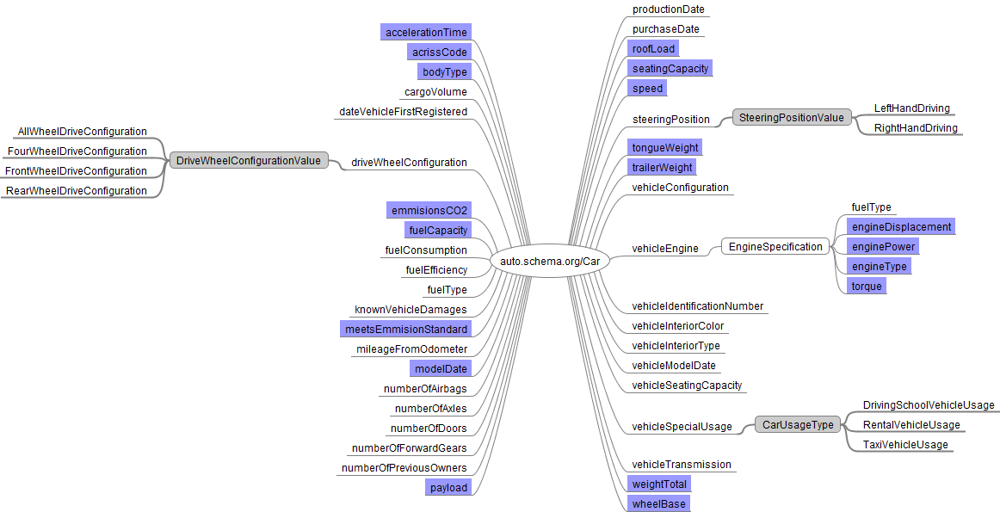
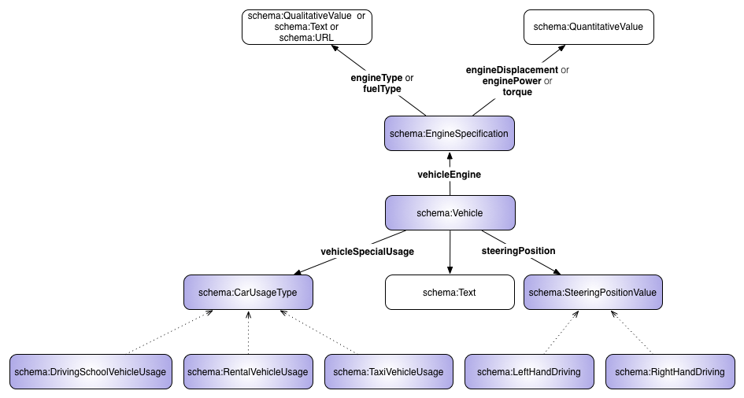
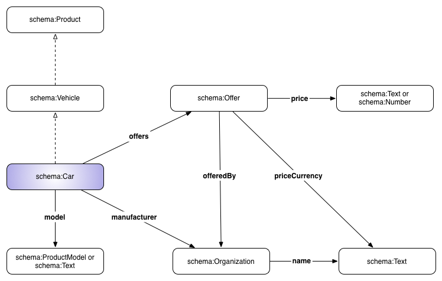

# Markup for Autos

## Table of contents

*   [Introduction](#introduction)
*   [Overview](#overview)
*   [Conceptual map](#conceptual_map)
*   [Hierarchy of terms](#hierarchy_of_terms)
    *   [Types](#schemaTypes)
    *   [Properties](#schemaProperties)
    *   [Enumerations](#schemaEnumerations)
*   [Basic models](#extensions_objects)
    *   [Vehicle type and its subtypes](#vehicle_type_subtypes)
    *   [Vehicle type and its properties](#vehicle_type_properties)
    *   [Car acriss code and the roofLoad](#car_acriss_code_roofLoad)
    *   [Drive wheel configuration for a vehicle](#drive_wheel_configuration)
    *   [Vehicle engine, steering position and car usage specification](#vehicle_engine_steering_position_usage)
    *   [Using properties of the type Offer to describe a car](#offer_car)
*   [Usage Examples](#usage_examples)
    *   [Example 1\. Used car](#used_car)
    *   [Example 2\. New, hybrid car](#hybrid_car)
    *   [Example 3\. Used car with damages](#used_car_with_damages)
    *   [Example 4\. Rental car with the acriss code](#rental_car_acriss_code)
*   [Acknowledgements](#acknowledgements)

## Introduction

This page provides background Information on the use of schema.org for marking up automobiles. For more information and communication with the community behind the project, please refer to: [http://w3.org/community/gao/](http://w3.org/community/gao/). This work has its roots in the GAO project ([Generic Automotive Ontology](http://www.automotive-ontology.org/)) and existing ontologies such as the [Vehicle Sales Ontology (VSO)](http://www.heppnetz.de/ontologies/vso/ns), [Car Options Ontology (COO)](https://lov.linkeddata.es/dataset/lov/vocabs/coo) and [Used Cars Ontology (UCO)](http://purl.org/uco).

## Overview

The automotive extension of schema.org (auto.schema.org) refers to the most important real-world objects related to popular vehicles like cars, buses (coaches) and motorcycles. Whilst the extension allows for a fair description of all kinds of vehicles, it focuses predominantly on passenger automobiles from the retail market perspective.

There are four major classes of objects reflected in the extension:

*   The most popular types of automobiles and their usage
*   The automobile configuration
*   The engines and their characteristics
*   The features of the automobiles that relate to their commercial aspects as products

In the selection of types and properties for each of the classes of objects, the extension authors (see "Acknowledgments") were motivated by the principles of simplicity and practicality. 'Simplicity' led to an extremely small set of terms, resulting in a lean extension, whilst 'practicality' limited the scope of terms to reflect the most important objects, as seen from the automotive market perspective.

The principle of 'Occam's Razor' dictated the focus on terms, reflecting general consumer preferences observed from the perspective of their searches and typical digital activities related to automobiles.

Some of the types and properties that reflect these objects and describe their features, were already defined in schema.org almost from its beginning. Others have entered into life in the "core" vocabulary in May 2015 with the publication of [schema.org v2.0](https://schema.org/docs/releases.html#v2.0), and the totality of the terms was made available in May 2016 with the publication of [schema.org v3.0](http://htmlpreview.github.io/?https://github.com/schemaorg/schemaorg/blob/main/data/releases/3.0/schema-all.html), alongside the creation of [http://auto.schema.org](http://auto.schema.org).

Despite these various origins, in this page we treat them all equally using the umbrella term "automotive extension", as all of them exist in the common shared schema.org namespace.

There is no doubt that the extension in its current form cannot satisfy all the needs of the automotive industry. However, what this extension does do is to create a framework that can be utilised now and can bring huge benefits despite its small footprint.

The authors of this project are committed to the future development of the automotive 'face' of the schema.org vocabulary. This is particularly important in the years to come as the whole automotive industry is dramatically changing with the proliferation of electric vehicles, popularity of "connected cars" and the advent of autonomous autos.

This on-going activity will include both the addition and amendment of the most important types and properties to the schema.org core, to the auto.schema.org extension and also to the future "external" automotive extensions of schema.org that need not be limited by the minimalism of the earlier "lean" approach.

## The conceptual map and hierarchy of the automotive extension

The following diagrams represent the conceptual map of the extension. As explained before, the map contains elements from both the schema.org "core" and the actual automotive extension (at [http://auto.schema.org](http://auto.schema.org)).




The terms depicted on the <span style="background-color: #9999ff">violet background</span> are documented in auto.schema.org, the remaining terms are part of the core vocabulary of schema.org.

Please note that the map shows the extension properties for the type "Car", which, together with "BusOrCoach", "Motorcycle" and "MotorizedBicycle" is sub-classed from the "Vehicle" type already existing in schema.org.

## The complete hierarchy of all terms in the automotive extension (plus their hypernyms)

### Types:

*   [Thing](https://schema.org/Thing)
    *   [Product](https://schema.org/Product)
        *   [Vehicle](https://schema.org/Vehicle)
            *   [Car](https://schema.org/Car)
            *   [BusOrCoach](http://auto.schema.org/BusOrCoach)
            *   [Motorcycle](http://auto.schema.org/Motorcycle)
            *   [MotorizedBicycle](http://auto.schema.org/MotorizedBicycle)
    *   [Intangible](https://schema.org/Intangible)
        *   [Enumeration](https://schema.org/Enumeration)
            *   [QualitativeValue](https://schema.org/QualitativeValue)
                *   [CarUsageType](https://schema.org/CarUsageType)
                *   [DriveWheelConfigurationValue](https://schema.org/DriveWheelConfigurationValue)
                *   [SteeringPositionValue](https://schema.org/SteeringPositionValue)
        *   [StructuredValue](https://schema.org/StructuredValue)
            *   [EngineSpecification](https://schema.org/EngineSpecification)


### Properties:

*   [accelerationTime](http://auto.schema.org/accelerationTime)
*   [acrissCode](http://auto.schema.org/acrissCode)
*   [bodyType](http://auto.schema.org/bodyType)
*   [cargoVolume](https://schema.org/cargoVolume)
*   [dateVehicleFirstRegistered](https://schema.org/dateVehicleFirstRegistered)
*   [driveWheelConfiguration](https://schema.org/driveWheelConfiguration)
*   [emissionsCO2](http://auto.schema.org/emissionsCO2)
*   [engineDisplacement](http://auto.schema.org/engineDisplacement)
*   [enginePower](http://auto.schema.org/enginePower)
*   [engineType](http://auto.schema.org/engineType)
*   [fuelCapacity](http://auto.schema.org/fuelCapacity)
*   [fuelConsumption](https://schema.org/fuelConsumption)
*   [fuelEfficiency](https://schema.org/fuelEfficiency)
*   [fuelType](https://schema.org/fuelType)
*   [knownVehicleDamages](https://schema.org/knownVehicleDamages)
*   [meetsEmissionStandard](http://auto.schema.org/meetsEmissionStandard)
*   [mileageFromOdometer](https://schema.org/mileageFromOdometer)
*   [modelDate](http://auto.schema.org/modelDate)
*   [numberOfAirbags](https://schema.org/numberOfAirbags)
*   [numberOfAxles](https://schema.org/numberOfAxles)
*   [numberOfDoors](https://schema.org/numberOfDoors)
*   [numberOfForwardGears](https://schema.org/numberOfForwardGears)
*   [numberOfPreviousOwners](https://schema.org/numberOfPreviousOwners)
*   [payload](http://auto.schema.org/payload)
*   [productionDate](https://schema.org/productionDate)
*   [purchaseDate](https://schema.org/purchaseDate)
*   [roofLoad](http://auto.schema.org/roofLoad)
*   [seatingCapacity](http://auto.schema.org/seatingCapacity)
*   [speed](http://auto.schema.org/speed)
*   [steeringPosition](https://schema.org/steeringPosition)
*   [tongueWeight](http://auto.schema.org/tongueWeight)
*   [torque](http://auto.schema.org/torque)
*   [trailerWeight](http://auto.schema.org/trailerWeight)
*   [vehicleConfiguration](https://schema.org/vehicleConfiguration)
*   [vehicleEngine](https://schema.org/vehicleEngine)
*   [vehicleIdentificationNumber](https://schema.org/vehicleIdentificationNumber)
*   [vehicleInteriorColor](https://schema.org/vehicleInteriorColor)
*   [vehicleInteriorType](https://schema.org/vehicleInteriorType)
*   [vehicleModelDate](https://schema.org/vehicleModelDate)
*   [vehicleSeatingCapacity](https://schema.org/vehicleSeatingCapacity)
*   [vehicleSpecialUsage](https://schema.org/vehicleSpecialUsage)
*   [vehicleTransmission](https://schema.org/vehicleTransmission)
*   [weightTotal](http://auto.schema.org/weightTotal)
*   [wheelbase](http://auto.schema.org/wheelbase)

### Enumerations (per type):

*   [CarUsageType](http://auto.schema.org/CarUsageType) (type)
    *   [DrivingSchoolVehicleUsage](http://auto.schema.org/DrivingSchoolVehicleUsage)
    *   [RentalVehicleUsage](http://auto.schema.org/RentalVehicleUsage)
    *   [TaxiVehicleUsage](http://auto.schema.org/TaxiVehicleUsage)
*   [DriveWheelConfigurationValue](https://schema.org/DriveWheelConfigurationValue) (type)
    *   [AllWheelDriveConfiguration](https://schema.org/AllWheelDriveConfiguration)
    *   [FourWheelDriveConfiguration](https://schema.org/FourWheelDriveConfiguration)
    *   [FrontWheelDriveConfiguration](https://schema.org/FrontWheelDriveConfiguration)
    *   [RearWheelDriveConfiguration](https://schema.org/RearWheelDriveConfiguration)
*   [SteeringPositionValue](https://schema.org/SteeringPositionValue) (type)
    *   [LeftHandDriving](https://schema.org/LeftHandDriving)
    *   [RightHandDriving](https://schema.org/RightHandDriving)


## The basic models of the objects in the automotive extension

The diagram below illustrates the basic pattern for the description of the main classes of the objects of interest in the extension.

### The Vehicle type and its subtypes


The top 'type' for the description of the vehicles, [Vehicle](https://schema.org/Vehicle), (which is a subtype of [Product](https://schema.org/Product)) is specified by the most important specified types: [MotorizedBicycle](https://schema.org/MotorizedBicycle), [Motorcycle](https://schema.org/Motorcycle), [Car](https://schema.org/Car) and [BusOrCoach](https://schema.org/BusOrCoach).

### The Vehicle type and its properties


The vehicle can be identified by the following schema.org properties: [cargoVolume](https://schema.org/cargoVolume), [dateVehicleFirstRegistered](https://schema.org/dateVehicleFirstRegistered), [driveWheelConfiguration](https://schema.org/driveWheelConfiguration), [fuelConsumption](https://schema.org/fuelConsumption), [fuelEfficiency](https://schema.org/fuelEfficiency), [fuelType](https://schema.org/fuelType), [knownVehicleDamages](https://schema.org/knownVehicleDamages), [mileageFromOdometer](https://schema.org/mileageFromOdometer), [numberOfAirbags](https://schema.org/numberOfAirbags), [numberOfAxles](https://schema.org/numberOfAxles), [numberOfDoors](https://schema.org/numberOfDoors), [numberOfForwardGears](https://schema.org/numberOfForwardGears), [numberOfPreviousOwners](https://schema.org/numberOfPreviousOwners), [productionDate](https://schema.org/productionDate), [purchaseDate](https://schema.org/purchaseDate), [stffeeringPosition](https://schema.org/steeringPosition), [vehicleConfiguration](https://schema.org/vehicleConfiguration), [vehicleEngine](https://schema.org/vehicleEngine), [vehicleIdentificationNumber](https://schema.org/vehicleIdentificationNumber), [vehicleInteriorColor](https://schema.org/vehicleInteriorColor), [vehicleInteriorType](https://schema.org/vehicleInteriorType), [vehicleModelDate](https://schema.org/vehicleModelDate), [vehicleSeatingCapacity](https://schema.org/vehicleSeatingCapacity), [vehicleSpecialUsage](https://schema.org/vehicleSpecialUsage) and [vehicleTransmission](https://schema.org/vehicleTransmission).

The auto.schema.org extension adds the following properties: [accelerationTime](http://auto.schema.org/accelerationTime), [bodyType](http://auto.schema.org/bodyType), [emissionsCO2](http://auto.schema.org/emissionsCO2), [fuelCapacity](http://auto.schema.org/fuelCapacity), [meetsEmissionStandard](http://auto.schema.org/meetsEmissionStandard), [modelDate](http://auto.schema.org/modelDate), [payload](http://auto.schema.org/payload), [seatingCapacity](http://auto.schema.org/seatingCapacity), [speed](http://auto.schema.org/speed), [tongueWeight](http://auto.schema.org/tongueWeight), [trailerWeight](http://auto.schema.org/trailerWeight), [weightTotal](http://auto.schema.org/weightTotal) and [wheelbase](http://auto.schema.org/wheelbase).

### The car acriss code and the roof load


Apart from all the properties from [Vehicle](https://schema.org/Vehicle) that the types [Car](https://schema.org/Car) and [BusOrCoach](https://schema.org/BusOrCoach) inherit, they also possess two extra properties, namely: [acrissCode](http://auto.schema.org/acrissCode) and [roofLoad](http://auto.schema.org/roofLoad).

### The drive wheel configuration for a vehicle


The [driveWheelConfiguration](https://schema.org/driveWheelConfiguration) of the [Vehicle](https://schema.org/Vehicle) is described either by [Text](https://schema.org/Text) or through the following members of [DriveWheelConfigurationValue](https://schema.org/DriveWheelConfigurationValue): [AllWheelDriveConfiguration](http://auto.schema.org/AllWheelDriveConfiguration), [FourWheelDriveConfiguration](http://auto.schema.org/FourWheelDriveConfiguration), [FrontWheelDriveConfiguration](http://auto.schema.org/FrontWheelDriveConfiguration) and [RearWheelDriveConfiguration](http://auto.schema.org/RearWheelDriveConfiguration).

### The vehicle engine, steering position and car usage specification



The vehicle's engine can be identified by the [vehicleEngine](https://schema.org/vehicleEngine) property and [EngineSpecification](http://auto.schema.org/EngineSpecification) type. [EngineSpecification](http://auto.schema.org/EngineSpecification) can be then characterized by the following properties: [fuelType](https://schema.org/fuelType), [engineDisplacement](http://auto.schema.org/engineDisplacement), [enginePower](http://auto.schema.org/enginePower), [engineType](http://auto.schema.org/engineType) and [torque](http://auto.schema.org/torque).

To indicate whether the vehicle has been used for special purposes, one should use the [vehicleSpecialUsage](https://schema.org/vehicleSpecialUsage) property and the following members of [CarUsageType](http://auto.schema.org/CarUsageType): [DrivingSchoolVehicleUsage](http://auto.schema.org/DrivingSchoolVehicleUsage), [RentalVehicleUsage](http://auto.schema.org/RentalVehicleUsage) and [TaxiVehicleUsage](http://auto.schema.org/TaxiVehicleUsage).

The vehicle's [steeringPosition](https://schema.org/steeringPosition) is descibed by the [SteeringPositionValue](http://auto.schema.org/SteeringPositionValue) type and its two members: [LeftHandDriving](http://auto.schema.org/LeftHandDriving) and [RightHandDriving](http://auto.schema.org/RightHandDriving).

### Using properties of the type Offer to describe a car



In this example, the type [Offer](https://schema.org/Offer) is used to describe [Car](https://schema.org/Car) (a sub-class of [Vehicle](https://schema.org/Vehicle) which is a sub-class of [Product](https://schema.org/Product)) as a product offered to the client. This allows for the expression of the offered price for the car, the currency ([priceCurrency](https://schema.org/priceCurrency)) and the [Organization](https://schema.org/Organization) offering the product.

## Usage Examples

In this section of the document we present several examples of the use of the auto.schema.org mark-up in the HTML pages. Here are examples for:

### EXAMPLE 1\. A used car

PRE-MARKUP

```
<!-- Seller Details -->
<div>
  <strong>Contact Name: </strong> <span>Brent</span>
  <div>$18,000</div>
<!-- Car Details -->
  <div id="product">
    <strong>2009 Volkswagen Golf V GTI MY09 Direct-Shift Gearbox</strong>
    <p>2009 Volkswagen Golf V GTI MY09 Direct-Shift Gearbox in perfect
    mechanical condition and low kilometres. It's impressive 2.0 litre turbo engine 
    makes every drive a fun experience. Well looked after by one owner with full     
    service history. 
    It drives like new and has only done 50,000kms. (...)</p>
    
    <p><strong>Color: </strong>Black</p>
    <p><strong>Number of gears: </strong>6</p>
    <p><strong>Engine:</strong>
               4 cylinder Petrol Turbo Intercooled 2.0 L (1984 cc)</p>
    <p><strong>Number of airbags: </strong>6</p>
</div>
```

MICRODATA Markup

```
<!-- Seller Details -->
<div itemscope itemtype="https://schema.org/Person">
  <strong>Contact Name: </strong> <span itemprop="name givenName">Brent</span>
  <div itemprop="makesOffer" itemscope itemtype="https://schema.org/Offer" itemref="product">
    <span itemprop="priceSpecification" itemscope
        itemtype="https://schema.org/UnitPriceSpecification">
      <meta itemprop="priceCurrency" content="USD">$
      <meta itemprop="price" content="18000">18,000
     </span>
   </div>
</div>
<!-- Car Details -->
<div id="product" itemprop="itemOffered" itemscope itemtype="https://schema.org/Car">
  <strong itemprop="name">2009 Volkswagen Golf V GTI MY09 Direct-Shift Gearbox</strong>
  <p itemprop="description">2009 Volkswagen Golf V GTI MY09 Direct-Shift Gearbox in perfect
  mechanical condition and low kilometres. It's impressive 2.0 litre turbo engine makes
  every drive a fun experience. Well looked after by one owner with full service history.
  It drives like new and has only done 50,000kms. (...)</p>
  
  <p><strong>Color: </strong><span itemprop="color">Black</span></p>
  <p><strong>Number of gears: </strong><span itemprop="numberOfForwardGears">6</span></p>
  <div itemprop="vehicleEngine" itemscope itemtype="https://schema.org/EngineSpecification">
    <p><strong>Engine: </strong>
      <span itemprop="name">4 cylinder Petrol Turbo Intercooled 2.0 L (1984 cc)</span>
    </p>
  </div>
  <p><strong>Number of airbags: </strong><span itemprop="numberOfAirbags">6</span></p>
</div>                    
```

RDFa Markup

```
<!-- Seller Details -->
<div vocab="https://schema.org/" typeof="Person">
<strong>Contact Name: </strong> <span property="name givenName">Brent</span>
  <div property="makesOffer" typeof="Offer">
    <span property="priceSpecification" typeof="UnitPriceSpecification">
      <meta property="price" content="18000" />18,000
      <meta property="priceCurrency" content="USD" />$
    </span>
<!-- Car Details -->
    <div id="product" property="itemOffered" typeof="Car">
      <strong property="name">2009 Volkswagen Golf V GTI MY09 Direct-Shift Gearbox</strong>
      <p property="description">2009 Volkswagen Golf V GTI MY09 Direct-Shift Gearbox in perfect
        mechanical condition and low kilometres. It's impressive 2.0 litre turbo engine makes
        every drive a fun experience. Well looked after by one owner with full service history.
        It drives like new and has only done 50,000kms. (...)
      </p>
      
      <p><strong>Color: </strong><span property="color">Black</span></p>
      <p><strong>Number of gears: </strong><span property="numberOfForwardGears">6</span></p>
      <div property="vehicleEngine" typeOf="EngineSpecification">
        <p><strong>Engine: </strong>
          <span property="name">4 cylinder Petrol Turbo Intercooled 2.0 L (1984 cc)</span>
        </p>
      </div>
      <p><strong>Number of airbags: </strong><span property="numberOfAirbags">6</span></p>
    </div>
  </div>
</div>                    
```

JSON-LD Markup

```
<script type="application/ld+json">
{
  "@context": "https://schema.org",
  "@type": "Person",
  "name" : "Brent",
  "makesOffer" : {
        "@type" :"Offer",
        "priceSpecification" : {
            "@type" : "UnitPriceSpecification",
            "priceCurrency" : "USD",
            "price" : "18000" },
        "itemOffered" : {
            "@type" : "Car",
            "name" : "2009 Volkswagen Golf V GTI MY09 Direct-Shift Gearbox",
            "description" : "2009 Volkswagen Golf V GTI MY09 Direct-Shift Gearbox in perfect mechanical condition and low kilometres. It's impressive 2.0 litre turbo engine makes every drive a fun experience. Well looked after by one owner with full service history. It drives like new and has only done 50,000kms. (...)",
        "image" : "2009_Volkswagen_Golf_V_GTI_MY09.png",
        "color" : "Black",
        "numberOfForwardGears" : "6",
        "vehicleEngine" : {
            "@type": "EngineSpecification",
            "name" : "4 cylinder Petrol Turbo Intercooled 2.0 L (1984 cc)"
            },
        "numberOfAirbags" : "6"
        }
    }
}
</script>                   
```

### EXAMPLE 2\. A new, hybrid car

PRE-MARKUP

```
<!-- new car, hybrid car -->
<div>
<h3>Exemplary Hybrid Car Model Name, 2017</h3>
<p>release date 2016</p>
<p>91800.00 PLN</p>
<p>VIN: 1HTLCZWN0JH503089</p>
<p>White, hatchback, limited edition</p>
<p>leather, beige interior</p>
<p>4 doors, 6 airbags</p>
<p>5 passengers</p>
<ul>
  <li>Steering position: left side steering</li>
  <li><strong>ENGINE Type:</strong>  1580cc</li>
  <li><strong>Horsepower:</strong>  104 hp @ 5,700 rpm</li>
  <li><strong>Torque:</strong>  109 lb.-ft. @ 4,000 rpm</li>
  <li><strong>Fuel tank capacity:</strong> 11.9 gallons</li>
  <li><strong>Electric Motor Type:</strong>  AC Synchronous Permanent Magnet Motor</li>
  <li><strong>Horsepower:</strong>  43 hp</li>
  <li><strong>Torque:</strong>  125 lb.-ft.</li>
  <li><strong>Battery Capacity:</strong>  6.5 Ah</li>
  <li><strong>Battery Energy:</strong>  1.56 kWh</li>
  <li><strong>CO2 emissions:</strong> 88g/km</li>
  <li><strong>Wheel configuration:</strong> RWD</li>
  <li><strong>Number of axles:</strong> 2</li>
  <li><strong>Transmission Type:</strong> 6-speed dual clutch automatic transmission (DCT)</li>
  <li><strong>Wheelbase:</strong> 106.3 in.</li>
  <li><strong>Luggage capacity, rear seats upright:</strong> 19.4 cu. ft.</li>
  <li><strong>Weight:</strong> 1425 kg</li>
  <li><strong>Acceleration 0..100 km/h:</strong> 11.5 s</li>
  <li><strong>Top speed:</strong> 210 km/h</li>
  <li><strong>Fuel consumption:</strong> 3.5l/100km</li>
</ul>
<p>Car Company S.A.</p>
<p>Write to us: ul. Borowa 16, 20-170 Łaziska Górne</p>
<p>Telephone: 670 000 070</p>
<p>Available from 29 May, 2017</p>
</div>                    
```

JSON-LD Markup

```
<script type="application/ld+json">
{
  "@context":"https://schema.org/",
  "@type":"Car",
  "name":"Exemplary Car Model Name",
  "manufacturer":"Exemplary Car Manufacturer",   
  "vehicleConfiguration":"limited edition",
  "vehicleIdentificationNumber":"1HTLCZWN0JH503089",
  "productionDate":"2017",      
  "modelDate":"2016",
  "bodyType":"hatchback",
  "steeringPosition":{"@id":"https://schema.org/LeftHandDriving"},    
  "driveWheelConfiguration":{"@id":"https://schema.org/RearWheelDriveConfiguration"},
  "color":"White",   
  "vehicleInteriorType":"leather",
  "vehicleInteriorColor":"beige",  
  "numberOfAirbags" : "6",   
  "numberOfAxles":"2",
  "numberOfDoors": "5",
  "seatingCapacity": "5", 
  "cargoVolume":{
        "@type":"QuantitativeValue",
        "value":"19.4",
        "unitCode":"FTQ"},        
  "weightTotal":{
        "@type":"QuantitativeValue",
        "maxValue":"1425",
        "unitCode":"KGM"},         

  "wheelbase":{
        "@type":"QuantitativeValue",
        "value":"106.3",
        "unitCode":"INH"},    

  "vehicleTransmission": "automatic gearbox",   
  "numberOfForwardGears" : "6",   

  "vehicleEngine":[
      {
     "@type":"EngineSpecification",
     "engineType":"internal combustion engine",
     "fuelType":"petrol",
     "engineDisplacement":{
        "@type":"QuantitativeValue",
        "value":"1580",
        "unitCode":"CMQ"},
     "torque":{
        "@type":"QuantitativeValue",
        "value":"109",
        "unitCode":"F17"},   
     "enginePower":{
        "@type":"QuantitativeValue",
        "value":"104",
        "unitCode":"BHP"}},
     {
     "@type":"EngineSpecification",
     "engineType":"electric motor",
     "torque":{
        "@type":"QuantitativeValue",
        "value":"125",
        "unitCode":"F17"},       
     "enginePower":{
        "@type":"QuantitativeValue",
        "value":"43",
        "unitCode":"BHP"}}
  ], 

  "accelerationTime":{
     "@type":"QuantitativeValue",
     "value":"11.5",
     "unitCode":"SEC",
     "valueReference":{
        "@type":"QuantitativeValue",
       "unitText":"0..100 km/h"
     }}, 

   "speed":{
        "@type":"QuantitativeValue",
        "maxValue":"210",
        "unitCode":"KMH"},   

  "fuelCapacity":[{
        "@type":"QuantitativeValue",
        "value":"11.9",
        "unitCode":"GLL"},
        {
        "@type":"QuantitativeValue",
        "value":"6.5",
        "unitCode":"AMH",
        "description":"Battery Energy 1.56 kWh"}
        ],

  "fuelConsumption":{
        "@type":"QuantitativeValue",
        "value":"3.5",
        "unitText":"L/100km"},

  "mileageFromOdometer":{
     "@type":"QuantitativeValue",
     "value":"1",
     "unitCode":"KMT"
  },

  "emissionsCO2": "88",  

  "offers":{
     "@type":"Offer",
     "price":"91800.00",
     "priceCurrency":"PLN",
     "availabilityStarts":"2017-05-29",
     "seller":{
        "@type":"Organization",
        "address":{
           "@type":"PostalAddress",
           "addressCountry":"PL",
           "streetAddress":"Borowa 16",
           "postalCode":"20-170",
           "addressLocality":"Łaziska Górne"
        },
        "telephone":"670 000 070",
        "name":"Car Company S.A."
     }
  }
}
</script>                
```

### EXAMPLE 3\. A used car with damages

PRE-MARKUP

```
<!-- used car with damages -->
<div>
<h3>Ex Driving School Car For Sale</h3>
<p><strong>Model:</strong>Exemplary Car Model Name</p>
<p><strong>Reg. date:</strong> 12/06/2008</p>
<p><strong>Purchase date:</strong> 17/01/2010</p>
<p><strong>Previous owners excl. current:</strong> 1</p>
<p>excellent condition apart from damaged area
car has damage to passenger front corner;
no chassis damaged, no radiators damaged, no airbags deployed</p>
</div>                
```

JSON-LD Markup

```
<script type="application/ld+json">
{
  "@context":"https://schema.org/",
  "@type":"Car",
  "name":"Exemplary Car Model Name",
  "knownVehicleDamages":"excellent condition apart from damaged area car has damage to passenger front corner; no chassis damaged, no radiators damaged, no airbags deployed",
  "dateVehicleFirstRegistered":"2008-06-12",
  "purchaseDate":"2010-01-17",
  "numberOfPreviousOwners":"2",
  "vehicleSpecialUsage":{"@id":"https://schema.org/DrivingSchoolVehicleUsage"}
}
</script>
```

### EXAMPLE 4\. A rental car with the Acriss code

PRE-MARKUP

```
<!-- rental car with acriss code -->
<div>
<h2>Rent Car Company</h2>

<h3>Exemplary Car Model Name | <strong>SCAR</strong> </h3>
<p>Rental price per day: EUR 20</p>
<p>Equipment, seats and luggage</p>
<ul>
  <li>Air conditioning available
  <li>4 Doors</li>
  <li>5 Passengers</li>
  <li>2 Suitcase(s)</li>
  <li>2 Bag(s)</li>
  <li>Automatic transmission</li>
</ul>
</div>                
```

JSON-LD Markup

```
<script type="application/ld+json">
{
   "@context":"https://schema.org/",
   "@type":"Car",
   "name":"Exemplary Car Model Name",
   "acrissCode":"SCAR",
   "seatingCapacity": "5",
   "numberOfDoors": "4",
   "vehicleTransmission": "automatic gearbox",
   "cargoVolume":[{
         "@type":"QuantitativeValue",
         "value":"2",
         "unitText":"bags"},
         {
         "@type":"QuantitativeValue",
         "value":"2",
         "unitText":"suitcases"}],
   "additionalProperty":{
        "@type":"PropertyValue",
        "name":"air conditioning"
        },
   "offers":{
     "@type":"Offer",
     "offeredBy": {
        "@type": "AutoRental",
        "name":"Rent Car Company",
        "image": "http://AutoRental.com/rent_company.jpg"
      },    
      "priceSpecification": {
        "@type": "UnitPriceSpecification",
        "price": "20",
        "priceCurrency": "EUR",
        "referenceQuantity": {
          "@type": "QuantitativeValue",
          "value": "1",
          "unitCode": "DAY"
        }
      }
  }   
}  
</script>                
```

## Acknowledgments

We would like to thank the following individuals: Martin Hepp, Dominik Kuzinski, Robert Trypuz and Karol Szczepański, coordinated by Mirek Sopek of MakoLab SA for creating the automotive extension and this document.

The maintenance and proposals for new elements and discussions are coordinated by the W3C Community for the Generic Automotive Ontology: [https://www.w3.org/community/gao/](https://www.w3.org/community/gao/).
