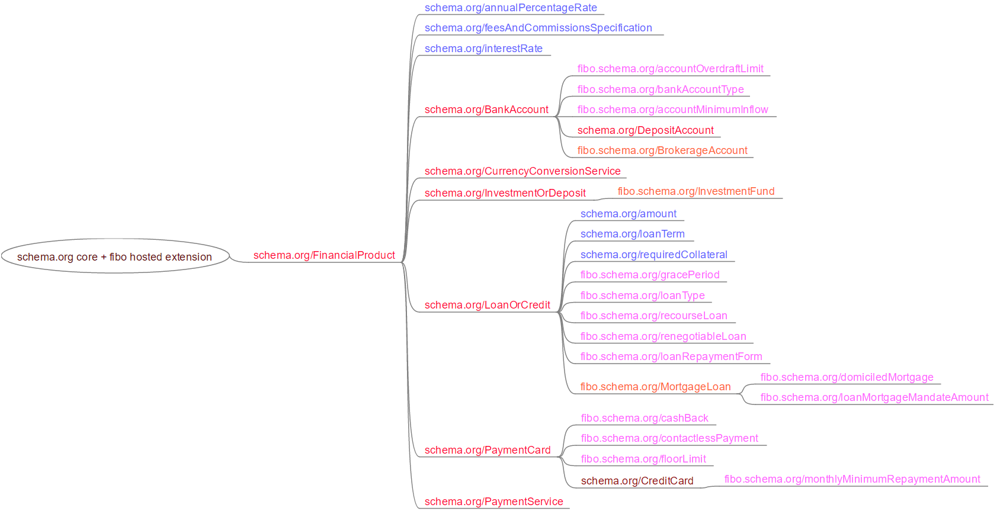
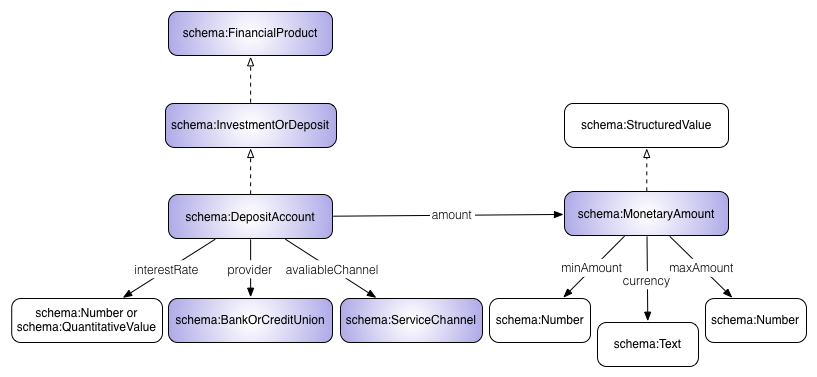
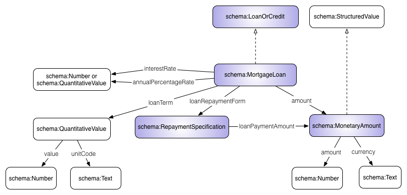
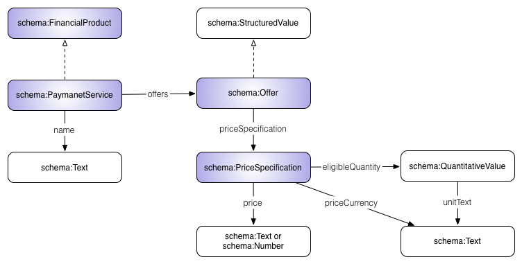

# Markup for Banks and Financial Institutions

## Introduction

This page provides background information on the use of schema.org for marking up banks and their products. For more information and for communication with the community behind the project, please refer to [http://w3.org/community/fibo/](http://w3.org/community/fibo/).

This work has its roots in the Financial Industry Business Ontology project (see [http://www.fibo.org/schema](http://www.fibo.org/schema) for details). Many class and property definitions are inspired, based on, or aligned with [http://www.fibo.org](http://www.fibo.org).

## Overview

The financial extension of schema.org refers to the most important real world objects related to banks and financial institutions. There are three major classes of the objects reflected in the extension:

*   A bank and its identification mechanism
*   A financial product
*   An offer to the client

In the selection of types and properties for each of the class of objects, the extension authors (see "Acknowledgments") were motivated by the principles of simplicity and practicality. 'Simplicity' led to an extremely small set of terms, resulting in a lean extension, whilst 'practicality' limited the scope of terms to reflect the most important objects, as seen from the retail banking perspective.

The principles of 'Occam’s Razor' dictated the focus on terms, reflecting the general consumer preferences observed from the perspective of their searches and typical digital financial activities.

Some of the types and properties that reflect these objects, that describe their features, were already defined in schema.org almost from its beginning. Others have entered into life in the "core" vocabulary in [May 2016](https://www.w3.org/community/fibo/2016/05/17/we-are-in-schema-org-3-0) with the publication of schema.org v3.0, and the totality of the terms was made available in March 2017 with the publication of schema.org v3.2\. Until the dedicated financial extension is published in the near future, most of these terms are now "located" in [http://pending.schema.org](http://pending.schema.org). Following the rules of schema.org extensions, they enjoy the canonicity of the schema.org main namespace.

Despite their various origins, in this page we treat them all equally using the umbrella term "financial extension". As all of them exist in the common shared schema.org namespace, from a practical perspective it is irrelevant how they entered into existence.

There is no doubt that the extension in the current form may not satisfy all the needs of the banks and other financial institutions. However, it creates a framework that can be utilised now and can bring huge benefits despite its small footprint.

The authors of this project are committed to the future development of the financial "face" of the schema.org vocabulary. This will include both the addition and amendment of the most important types and properties to the schema.org core, to the hosted extension and also to the future "external" financial extensions to schema.org that need not be limited by the minimalism of the earlier "lean" approach.

## The conceptual map and the hierarchy of the financial extension

The following diagrams present the conceptual map of the extension. As it was explained before, the map contains elements from both the schema.org "core" and the actual financial extension (at the moment of writing this was placed in pending.schema.org):

 

The banks are identified by their LEI (Legal Entity Identifier) code: [leiCode](https://schema.org/leiCode) (upper diagram above) and terms that were already present in schema.org (see "Basic Models" below).

The majority of terms in the extension allow for the description of financial products and their features (lower diagram above), reflecting the primary focus of the extension on the "retail view" of the financial industry.

There are also auxiliary terms that help in the description of offers from banks ("[ExchangeRateSpecification](https://schema.org/ExchangeRateSpecification)", "[RepaymentSpecification](https://schema.org/RepaymentSpecification)").

## The complete hierarchy of all terms in the financial extension

All of the extension terms are depicted in <span style="color:red">red</span>. The branches already defined in the schema.org are depicted in <span style="color:gray">gray</span>.

### Types:

*   [Thing](http://pending.schema.org/Thing)
    *   [Action](http://pending.schema.org/Action)
        *   [TransferAction](http://pending.schema.org/TransferAction)
            *   [MoneyTransfer](http://pending.schema.org/MoneyTransfer)
    *   [Intangible](http://pending.schema.org/Intangible)
        *   [Service](http://pending.schema.org/Service)
            *   [FinancialProduct](http://pending.schema.org/FinancialProduct)
                *   [BankAccount](http://pending.schema.org/BankAccount)
                    *   [DepositAccount](http://pending.schema.org/DepositAccount)
                *   [CurrencyConversionService](http://pending.schema.org/CurrencyConversionService)
                *   [InvestmentOrDeposit](http://pending.schema.org/InvestmentOrDeposit)
                    *   [BrokerageAccount](http://pending.schema.org/BrokerageAccount)
                    *   [DepositAccount](http://pending.schema.org/DepositAccount)
                    *   [InvestmentFund](http://pending.schema.org/InvestmentFund)
                *   [LoanOrCredit](http://pending.schema.org/LoanOrCredit)
                    *   [CreditCard](http://pending.schema.org/CreditCard)
                    *   [MortgageLoan](http://pending.schema.org/MortgageLoan)
                *   [PaymentCard](http://pending.schema.org/PaymentCard)
                    *   [CreditCard](http://pending.schema.org/CreditCard)
                *   [PaymentService](http://pending.schema.org/PaymentService)
            *   [StructuredValue](http://pending.schema.org/StructuredValue)
                *   [ExchangeRateSpecification](http://pending.schema.org/ExchangeRateSpecification)
                *   [MonetaryAmount](http://pending.schema.org/MonetaryAmount)
                *   [RepaymentSpecification](http://pending.schema.org/RepaymentSpecification)

### Properties:

*   [Thing](http://pending.schema.org/Thing)
    *   [Property](http://pending.schema.org/Property)
        *   [annualPercentageRate](http://pending.schema.org/annualPercentageRate)
        *   [feesAndCommissionsSpecification](http://pending.schema.org/feesAndCommissionsSpecification)
        *   [interestRate](http://pending.schema.org/interestRate)
        *   [identifier](http://pending.schema.org/identifier)
            *   [leiCode](http://pending.schema.org/leiCode)
        *   [duration](http://pending.schema.org/duration)
            *   [loanTerm](http://pending.schema.org/loanTerm)
        *   [requiredCollateral](http://pending.schema.org/requiredCollateral)
        *   [accountMinimumInflow](http://pending.schema.org/accountMinimumInflow)
        *   [accountOverdraftLimit](http://pending.schema.org/accountOverdraftLimit)
        *   [amount](http://pending.schema.org/amount)
        *   [bankAccountType](http://pending.schema.org/bankAccountType)
        *   [beneficiaryBank](http://pending.schema.org/beneficiaryBank)
        *   [cashBack](http://pending.schema.org/cashBack)
        *   [contactlessPayment](http://pending.schema.org/contactlessPayment)
        *   [currency](http://pending.schema.org/currency)
        *   [currentExchangeRate](http://pending.schema.org/currentExchangeRate)
        *   [domiciledMortgage](http://pending.schema.org/domiciledMortgage)
        *   [downPayment](http://pending.schema.org/downPayment)
        *   [earlyPrepaymentPenalty](http://pending.schema.org/earlyPrepaymentPenalty)
        *   [exchangeRateSpread](http://pending.schema.org/exchangeRateSpread)
        *   [floorLimit](http://pending.schema.org/floorLimit)
        *   [gracePeriod](http://pending.schema.org/gracePeriod)
        *   [loanMortgageMandateAmount](http://pending.schema.org/loanMortgageMandateAmount)
        *   [loanPaymentAmount](http://pending.schema.org/loanPaymentAmount)
        *   [loanPaymentFrequency](http://pending.schema.org/loanPaymentFrequency)
        *   [loanRepaymentForm](http://pending.schema.org/loanRepaymentForm)
        *   [loanType](http://pending.schema.org/loanType)
        *   [monthlyMinimumRepaymentAmount](http://pending.schema.org/monthlyMinimumRepaymentAmount)
        *   [numberOfLoanPayments](http://pending.schema.org/numberOfLoanPayments)
        *   [recourseLoan](http://pending.schema.org/recourseLoan)
        *   [renegotiableLoan](http://pending.schema.org/renegotiableLoan)

## The basic models of the financial objects

The diagram below illustrates the basic pattern for the description of the main classes of the financial objects of interest.

### A bank


The main type for the description of Banks and Credit Unions, [BankOrCreditUnion](https://schema.org/BankOrCreditUnion) is a subclass of the following sequence of schema.org classes: [FinancialService](https://schema.org/FinancialService) -> [LocalBusiness](https://schema.org/LocalBusiness) -> ([Organization](https://schema.org/Organization) and [Place](https://schema.org/Place)). The institution can be identified by the following schema.org properties: [name](https://schema.org/name), [contactPoint](https://schema.org/contactPoint), [address](https://schema.org/address) and the website [url](https://schema.org/url). The extension adds the fundamental global identifier of the financial institution: [leiCode](https://schema.org/leiCode): Legal Entity Identifier (the alphanumeric code or LEI URI) .

### A financial product


The top ‘type’ for the description of the financial products, [FinancialProduct](https://schema.org/FinancialProduct), (which is a subclass of schema.org [Service](https://schema.org/Service) type) is sub-classed by the most important specific products: [BankAccount](https://schema.org/BankAccount), [PaymentCard](https://schema.org/PaymentCard), [LoanOrCredit](https://schema.org/LoanOrCredit), [InvestmentOrDeposit](https://schema.org/InvestmentOrDeposit), [PaymentService](https://schema.org/PaymentService) and [CurrencyConversionService](https://schema.org/CurrencyConversionService).

Examples of the specific products are illustrated in the following diagrams:



In this example, the [DepositAccount](https://schema.org/DepositAccount) (sub-class of the sequence of [InvestmentOrDeposit](https://schema.org/InvestmentOrDeposit) -> [FinancialProduct](https://schema.org/FinancialProduct)) is described through the following properties: [amount](https://schema.org/amount), [interestRate](https://schema.org/interestRate), [provider](https://schema.org/provider) and [availableChannel](https://schema.org/availableChannel).



In this example, the [MortgageLoan](https://schema.org/MortgageLoan) (sub-class of the sequence of [LoanOrCredit](https://schema.org/LoanOrCredit) -> [FinancialProduct](https://schema.org/FinancialProduct)) is described through the following properties: [amount](https://schema.org/amount), [interestRate](https://schema.org/interestRate), [annualPercentageRate](https://schema.org/annualPercentageRate) (representing APR), [loanTerm](https://schema.org/loanTerm) and [loanRepaymentForm](https://schema.org/loanRepaymentForm).

### An offer

For the majority of the financial products, we enter into an area of schema.org relevant to commercial offers and other related terms coming from the GoodRelations Vocabulary for e-commerce:



In this example, the type [Offer](https://schema.org/Offer) is used to describe [PaymentService](https://schema.org/PaymentService) (a sub-class of [FinancialProduct](https://schema.org/FinancialProduct)) as a service offered to the client. The service can be properly named ([name](https://schema.org/name)) and the offered price is expressed through [PriceSpecification](https://schema.org/PriceSpecification) allowing for the specification of the price ([price](https://schema.org/price)) itself, the currency ([priceCurrency](https://schema.org/priceCurrency)) and the quantity ([eligibleQuantity](https://schema.org/eligibleQuantity)).

In another popular example, a payment card ([PaymentCard](https://schema.org/PaymentCard)) (sub-classed from both [PaymentMethod](https://schema.org/PaymentMethod) and [FinancialProduct](https://schema.org/FinancialProduct)) can be properly named ([name](https://schema.org/name)) and offered to the client using an element of the type [Offer](https://schema.org/Offer), allowing for expression of the offeror ([offeredBy](https://schema.org/offeredBy)) and its actual function ([BusinessFunction](https://schema.org/BusinessFunction)).


## Usage Examples

In this section of the document we present several examples of the use of the schema.org mark-up in the HTML pages. There are examples for: [BrokerageAccount](https://schema.org/BrokerageAccount), [InvestmentFund](https://schema.org/InvestmentFund), [MortgageLoan](https://schema.org/MortgageLoan), [RepaymentSpecification](https://schema.org/RepaymentSpecification), [ExchangeRateSpecification](https://schema.org/ExchangeRateSpecification), [CreditCard](https://schema.org/CreditCard) and [MoneyTransfer](https://schema.org/MoneyTransfer).

The first example ([BrokerageAccount](https://schema.org/BrokerageAccount)) is illustrated by a hypothetical pre-mark-up code and the mark-up in the three acceptable formats: Microdata, RDFa and JSON-LD. The remaining examples are illustrated only by JSON-LD code.

### BrokerageAccount

This example describes a typical Brokerage Account that allows an investor to deposit funds and place investment orders with a licensed broker or brokerage firm. The account is identified by its name and description. The specific data about it is expressed by the minimum account amount (minAmount), its basic currency ([currency](https://schema.org/currency)), a specification of fees and commissions ([feesAndCommissionsSpecification](https://schema.org/feesAndCommissionsSpecification)) and the available access channels ([availableChannel](https://schema.org/availableChannel)):

PRE-MARKUP:

```
<div>
  <h1>ExampleBank® 1st Brokerage Account</h1>
  <p>Our popular brokerage account lets you invest in everything from stocks and bonds to mutual funds, ETFs, and more. Take advantage of all our research and tools, expert insight, and investment guidance to support your investing decisions.</p>
  <p>Ability to manage your money and deposits from anywhere using <a href="http://www.examplebank.com/public/investing/pricing_services/mobile/android">EB Mobile</a></p>
  <p>$1,000 minimum investment to open an accouent</p>
  <p>No fees to open or maintain an account. Other account fees, fund expenses, and brokerage commissions may apply. Commissions: $8.95 per online equity trade; commission-free ExampleBank® ETF online trades in your ExampleBank® account</p>
</div>
```

MICRODATA:

```
div itemscope itemtype="https://schema.org/BrokerageAccount">
  <h1 itemprop="name">ExampleBank® 1st Brokerage Account</h1>
  <p itemprop="description">Our popular brokerage account lets you invest in everything from stocks and bonds to mutual funds, ETFs, and more. Take advantage of all our research and tools, expert insight, and investment guidance to support your investing decisions.</p>
  <p itemprop="availableChannel" itemscope itemtype="https://schema.org/ServiceChannel">Ability to manage your money and deposits from anywhere using <a itemprop="serviceMobileApp" href="http://http://www.examplebank.com/public/investing/pricing_services/mobile/android">ExampleBank® Mobile</a></p>
  <p itemprop="amount" itemscope itemtype="https://schema.org/MonetaryAmount"><span itemprop="currency" content="USD">$</span><span itemprop="minAmount" content="1000">1,000</span> minimum investment to open an account</p>
  <p itemprop="feesAndCommissionsSpecification">No fees to open or maintain an account. Other account fees, fund expenses, and brokerage commissions may apply. Commissions: $8.95 per online equity trade; commission-free ExampleBank® ETF online trades in your ExampleBank® account</p>
</div>
```

RDFA:

```
<div vocab="https://schema.org/" typeof="BrokerageAccount">
  <h1 property="name">ExampleBank® 1st Brokerage Account</h1>
  <p property="description">Our popular brokerage account lets you invest in everything from stocks and bonds to mutual funds, ETFs, and more. Take advantage of all our research and tools, expert insight, and investment guidance to support your investing decisions.</p>
  <p property="availableChannel" typeof="ServiceChannel">Ability to manage your money and deposits from anywhere using <a property="serviceMobileApp" href="http://http://www.examplebank.com/public/investing/pricing_services/mobile/android">ExampleBank® Mobile</a></p>
  <p property="amount" typeof="MonetaryAmount"><span property="currency" content="USD">$</span><span property="minAmount" content="1000">1,000</span> minimum investment to open an account</p>
  <p property="feesAndCommissionsSpecification">No fees to open or maintain an account. Other account fees, fund expenses, and brokerage commissions may apply. Commissions: $8.95 per online equity trade; commission-free ExampleBank® ETF online trades in your ExampleBank® account</p>
</div>
```

JSON-LD:

```
<script type="application/ld+json">
  {
    "@context": "https://schema.org",
    "@type": "BrokerageAccount",
    "name": "ExampleBank® 1st Brokerage Account",
    "description": "Our popular brokerage account lets you invest in everything from stocks and bonds to mutual funds, ETFs, and more. Take advantage of all our research and tools, expert insight, and investment guidance to support your investing decisions.",
    "amount": {
      "@type": "MonetaryAmount",
      "minAmount": "1000",
      "currency": "USD"
    },
    "feesAndCommissionsSpecification": "No fees to open or maintain an account. Other account fees, fund expenses, and brokerage commissions may apply. Commissions: $8.95 per online equity trade; commission-free ExampleBank® ETF online trades in your ExampleBank® account",
    "availableChannel": {
      "@type": "ServiceChannel",
      "serviceMobileApp": "http://http://www.examplebank.com/public/investing/pricing_services/mobile/android"
   }
  }
</script>  
```

### InvestmentFund

This example illustrates the JSON-LD code snippet supporting a description of an Investment Fund. The fund can be identified by a name and a description. The details of the typical investment can be specified using [currency](https://schema.org/currency), "minAmount", "maxAmount" and [interestRate](https://schema.org/interestRate).

JSON-LD:

```
<script type="application/ld+json">
{
  "@context": "https://schema.org",
  "@type": "InvestmentFund",
  "name": "Guaranteed Interest Fund",
  "description": "This type of secure investment grows your money at a guaranteed rate of interest for a fixed period. It is ideal for investors looking for capital security.",
  "amount": {
    "@type": "MonetaryAmount",
    "currency": "USD",
    "minAmount": "25000",
    "maxAmount": "90000"
  },
  "interestRate": "1.25"
}
</script>
```

### MortgageLoan, RepaymentSpecification

This example illustrates the JSON-LD code snippet supplementing a description of some Mortgage Loan and its Repayment Specification. The Loan can be identified by its type, name and description. The Loan details are described using: [amount](https://schema.org/amount) detailed by its value and the currency, [loanTerm](https://schema.org/loanTerm) detailed by the number of years (a [QuantitativeValue](https://schema.org/QuantitativeValue) with [unitCode](https://schema.org/unitCode) corresponding to an annum), [interestRate](https://schema.org/interestRate) and its APR – [annualPercentageRate](https://schema.org/annualPercentageRate).

The Repayment Specification is described through its frequency ([loanPaymentFrequency](https://schema.org/loanPaymentFrequency)), number of instalments ([numberOfLoanPayments](https://schema.org/numberOfLoanPayments)), down payment percentage ([downPayment](https://schema.org/downPayment)) and the payment amount ([loanPaymentAmount](https://schema.org/loanPaymentAmount)), further detailed by the [amount](https://schema.org/amount) and [currency](https://schema.org/currency).

JSON-LD:

```
<script type="application/ld+json">
  {
    "@context": "https://schema.org",
    "@type": "WebPage",
    "name": "Middle exchange rates of foreign currencies – table A",
    "mainEntity": {
      "@type": "ItemList",
      "name": "Table No. 047/A/NBP/2016 of 2016-03-09",
      "itemListElement": [
          {
            "@type": "ExchangeRateSpecification",
            "currency":"EUR",
            "currentExchangeRate":{
              "@type": "UnitPriceSpecification",
              "price": "4.3215",
              "priceCurrency": "PLN"
              }
          },
          {
            "@type": "ExchangeRateSpecification",
            "currency":"BRL",
            "currentExchangeRate":{
              "@type": "UnitPriceSpecification",
              "price": "1.0490",
              "priceCurrency": "PLN"
              }
          }
      ]
    }
  }
</script>
```

### CreditCard

This example illustrates the use of a JSON-LD code snippet to supplement the description of credit cards. The specific card being described is identified by its name ([name](https://schema.org/name)). The details of the offer presented by the card are expressed through: [annualPercentageRate](https://schema.org/annualPercentageRate), [interestRate](https://schema.org/interestRate), a percentage of "[cashback](http://pending.schema.org/cashBack)" (if applicable), the card grace period ([gracePeriod](http://pending.schema.org/gracePeriod)) and the flag for the contactless payments ([contactlessPayment](https://schema.org/contactlessPayment)). The additional properties, like [offeredBy](https://schema.org/offeredBy) allow to indicate the issuer of the card and annual cardholder’s cost of the card ([price](https://schema.org/price)) – further detailed by its currency ([currency](https://schema.org/currency)) and type ("@type").

JSON-LD:

```
<script type="application/ld+json">
{
  "@context": "https://schema.org",
  "@type": "CreditCard",
  "name": "ExampleBank® Platinum Cashback Credit Card",
  "amount": {
      "@type": "MonetaryAmount",
      "minAmount": "1200",
      "currency": "GBP"
  },
  "offers": {
      "@type": "Offer",
      "offeredBy": {
        "@type": "BankOrCreditUnion",
        "name":"ExampleBank"
      },    
      "priceSpecification": {
        "@type": "UnitPriceSpecification",
        "price": "25",
        "priceCurrency": "GBP",
        "referenceQuantity": {
          "@type": "QuantitativeValue",
          "value": "1",
          "unitCode": "ANN"
        }
      }
  },
  "annualPercentageRate": "28.2",
  "interestRate": "22.9",
  "cashBack": "1.25",
  "gracePeriod": "P45D",
  "contactlessPayment": "true"
}
</script>
```

### MoneyTransfer

This example illustrates the use of a JSON-LD code snippet to describe a requested bank transfer. The goal of the transfer is expressed using its [name](https://schema.org/name). The amount of the transfer is expressed by the [amount](https://schema.org/amount) detailed by the actual amount and the currency ([currency](https://schema.org/currency)). The transfer beneficiary is indicated by the respective property ([beneficiaryBank](https://schema.org/beneficiaryBank)).

JSON-LD:

```
<script type="application/ld+json">
{
  "@context": "https://schema.org/",
  "@type": "MoneyTransfer",
  "name": "Donate wikimedia.org",
  "amount": {
    "@type": "MonetaryAmount",
    "amount": "30",
    "currency": "USD"
  },
  "beneficiaryBank": "European ExampleBank, London"
}
</script>
```

## Acknowledgments

We would like to thank the following individuals: Dominik Kuzinski, Robert Trypuz, Richard Wallis, Adam Lis, Martin Hepp and Piotr Goetzen, coordinated by Mirek Sopek of MakoLab SA for creating the financial extension and this document.

The work has been endorsed by EDM Council and its FIBO team coordinated by Dennis Wisnosky and David Newman.

The maintenance and proposals for new elements and discussions are coordinated by W3C Community: [https://www.w3.org/community/fibo/](https://www.w3.org/community/fibo/).
